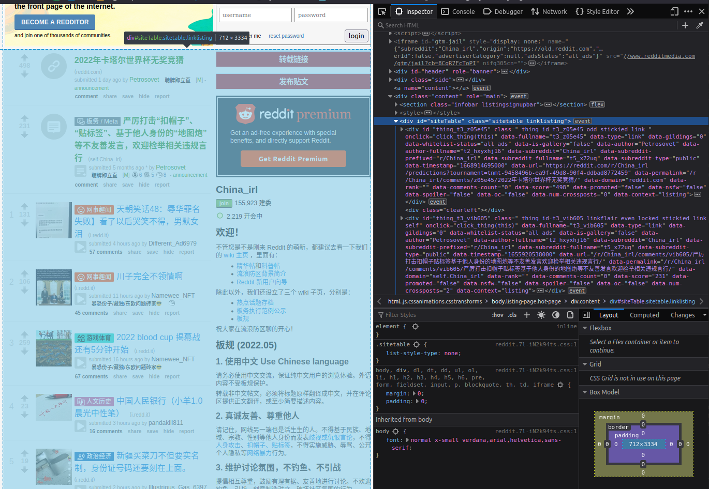

# Subreddit scraper

Scrape sub reddit posts using the old url `https://old.reddit.com`.

https://old.reddit.com/r/Chinatown_irl/

https://old.reddit.com/r/China_irl/


- scrape sub reddit
    - visit each post link
        - skip announcement
            - if the url contains `predictions?tournament`, always skip this link. no old version is available.
                - eg: `https://www.reddit.com/r/wallstreetbets/predictions?tournament=tnmt-0b14066a-ad68-4351-8261-d1c0740c44d2`
        - scrape comments
            - submit text
            - submit image
            - submit video
            - nsfw/spoiler

- find next button
    - extract link
    - go to link
    - repeat above


## Notes

The "next" button element:

```html
<span class="next-button">
    <a href="https://old.reddit.com/r/Music/?count=25&after=t3_z1lqur" rel="nofollow next">next ›</a>
</span>
```

The element that lists all posts:

```html
<div id="siteTable" class="sitetable linklisting">
```



When you forget to change user-agent:

```html
<!doctype html>
<html>

<head>
    <title>Too Many Requests</title>
</head>

<body>
    <h1>whoa there, pardner!</h1>
    <p>we're sorry, but you appear to be a bot and we've seen too many requests from you lately. we enforce a hard
        speed limit on requests that appear to comefrom bots to prevent abuse.</p>
    <p>if you are not a bot but are spoofing one via your browser's user agentstring: please change your user agent
        string to avoid seeing this messageagain.</p>
    <p>please wait 1 second(s) and try again.</p>
    <p>as a reminder to developers, we recommend that clients make no more than <a
            href="http://github.com/reddit/reddit/wiki/API">one request every two seconds</a> to avoid seeing this
        message.</p>
</body>

</html>
```